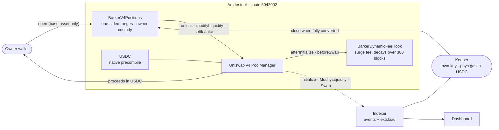

# Barker ALM Engine

**Yield-backed automated liquidity management, in two legs:**

1. **Arc leg** — an automated *single-sided concentrated liquidity* manager built on **Uniswap v4** (custom hook + dynamic fee + one-sided `modifyLiquidity`), targeting **Circle's Arc** chain where USDC is the gas token and the native asset.
2. **Aqua leg** — a *yield-backed market making* app on **1inch Aqua / SwapVM**: the maker's backing capital sits in an ERC-4626 vault earning yield while simultaneously quoting stablecoin pairs; on fill it atomically redeems exactly what is needed and re-deposits the remainder.

The unifying thesis: **idle backing capital should earn while it backs quotes**, and **a liquidity range is a better execution primitive than a limit order** when the pool pays fees. Both legs are the same engine pointed at two venues.

Built for **ETHOnline 2026** on the **Continuity Track** by [Barker](https://barker.money) (solo).

---

## Status

| | |
|---|---|
| Event | ETHOnline 2026 (Sep 4 – Sep 16, 2026) |
| Track | Continuity — hacking on an existing project |
| Team | solo |
| Arc leg | deployed to Arc testnet; **three full lifecycles** verified on chain — the second **closed unattended by the keeper**, the third run on the corrected fee hook and replaying the incident the keeper found ([tx list](arc/DEPLOYMENTS.md)). Mainnet: deployment-ready, deploying when Arc mainnet opens on Sep 16 |
| Aqua leg | solvency guard and settlement running through an unmodified `SwapVMRouter` on an Ethereum mainnet fork against live steakUSDC ([details](aqua/README.md)) |
| Automation | [`keeper/`](keeper/) — v4 event indexer and unattended keeper; closed Arc testnet position #2 on its own, Sep 8 |
| Dashboard | [`app/`](app/) — one screen over both legs: live Arc testnet positions and fees, live steakUSDC, the guard's effect on a quote, and a recorded fork run |
| Tests | 43 (`arc/`) · 45 (`aqua/`, incl. 11 on a mainnet fork) · 15 (`keeper/`) — all green |

## Try it

```bash
# Dashboard — reads Arc testnet and Ethereum mainnet from the browser; no wallet, no backend
cd app && npm install && npm run dev

# Arc leg — v4 hook and position manager against a real PoolManager
cd arc && forge install && forge test

# Aqua leg — SwapVM extensions; the fork suites need an archive-capable Ethereum RPC
cd aqua && forge install && ETHEREUM_RPC_URL=https://eth.drpc.org forge test

# Keeper — indexer and exit policy
cd keeper && npm install && npm test
```

---

## Prize tracks — what we built with each sponsor

Three partner submissions, all on the Continuity Track. Each section below is that sponsor's integration write-up; each sponsor also has its own feedback file.

### Uniswap Foundation — Best Uniswap Stack Contribution

**What we built.** A one-sided concentrated liquidity position manager and a dynamic-fee hook, integrated directly against the v4 `PoolManager` with no `v4-periphery` dependency. A range placed above spot and funded only in the base asset is a take-profit ladder that earns fees while it waits; the position manager enforces one-sidedness twice (against the live tick, then against the pool's own debit) and keeps custody with the position owner, so an off-chain keeper can close positions but can never redirect the proceeds. The hook raises the LP fee after a swap moves the price and decays it back over 300 blocks. Everything runs on a live v4 `PoolManager` on Arc testnet, and the keeper that closes positions reads pool state straight out of the singleton's storage.

v4 is not a bolt-on here — the one-sided range *is* the product primitive. Measured on chain, a fully crossed range realised **+0.3008%** over its geometric mean against the clean `fee / (1 − fee)` prediction of **+0.3009%**.

**Where to look** — contracts and lines, pinned to commit [`7e208c9`](https://github.com/barkermoney/barker-alm-engine/tree/7e208c9f2a8c60c51459122d1c6582d0aba4e0be):

| What | Where |
|---|---|
| `open` — range checked against the live tick, then re-checked against what the pool actually debited | [`BarkerV4Positions.sol` L195–247](https://github.com/barkermoney/barker-alm-engine/blob/7e208c9f2a8c60c51459122d1c6582d0aba4e0be/arc/src/BarkerV4Positions.sol#L195-L247) |
| `close` / `collect` — no recipient argument; proceeds always go to the position owner, so a keeper key cannot steal | [L251–277](https://github.com/barkermoney/barker-alm-engine/blob/7e208c9f2a8c60c51459122d1c6582d0aba4e0be/arc/src/BarkerV4Positions.sol#L251-L277) |
| Lock pattern — `unlock` → `unlockCallback` → `modifyLiquidity`; a zero delta is the fee-collection path | [L281–317](https://github.com/barkermoney/barker-alm-engine/blob/7e208c9f2a8c60c51459122d1c6582d0aba4e0be/arc/src/BarkerV4Positions.sol#L281-L317) |
| Flash accounting — `sync` / `settle` / `take`, paid straight to the owner so funds never rest in the contract | [L322–336](https://github.com/barkermoney/barker-alm-engine/blob/7e208c9f2a8c60c51459122d1c6582d0aba4e0be/arc/src/BarkerV4Positions.sol#L322-L336) |
| Position salt per registry id, so positions sharing a range stay distinct in PoolManager accounting | [L186–188](https://github.com/barkermoney/barker-alm-engine/blob/7e208c9f2a8c60c51459122d1c6582d0aba4e0be/arc/src/BarkerV4Positions.sol#L186-L188) |
| `feesOwed` — `liquidity × (growthInside − growthInsideLast) / 2**128`, not the raw accumulator ([FEEDBACK §15](FEEDBACK.md#15-getfeegrowthinside-reads-like-fees-owed-and-is-off-by-2128)) | [L168–182](https://github.com/barkermoney/barker-alm-engine/blob/7e208c9f2a8c60c51459122d1c6582d0aba4e0be/arc/src/BarkerV4Positions.sol#L168-L182) |
| Hook permissions `AFTER_INITIALIZE \| BEFORE_SWAP`, checked against the hook's own address in the constructor | [`BarkerDynamicFeeHook.sol` L37](https://github.com/barkermoney/barker-alm-engine/blob/7e208c9f2a8c60c51459122d1c6582d0aba4e0be/arc/src/BarkerDynamicFeeHook.sol#L37), [L91](https://github.com/barkermoney/barker-alm-engine/blob/7e208c9f2a8c60c51459122d1c6582d0aba4e0be/arc/src/BarkerDynamicFeeHook.sol#L91) |
| `afterInitialize` → `updateDynamicLPFee`, refusing pools without the dynamic-fee sentinel | [L121–134](https://github.com/barkermoney/barker-alm-engine/blob/7e208c9f2a8c60c51459122d1c6582d0aba4e0be/arc/src/BarkerDynamicFeeHook.sol#L121-L134) |
| `beforeSwap` returning an LP fee override (`OVERRIDE_FEE_FLAG`) | [L148–182](https://github.com/barkermoney/barker-alm-engine/blob/7e208c9f2a8c60c51459122d1c6582d0aba4e0be/arc/src/BarkerDynamicFeeHook.sol#L148-L182) |
| Surge dated to the block the move happened, decayed with the stored surge — the Sep 10 fix ([FEEDBACK §16](FEEDBACK.md)) | [L189–210](https://github.com/barkermoney/barker-alm-engine/blob/7e208c9f2a8c60c51459122d1c6582d0aba4e0be/arc/src/BarkerDynamicFeeHook.sol#L189-L210) |
| `quoteFee` — the same code path as the charge, so the quote cannot drift from it | [L215–225](https://github.com/barkermoney/barker-alm-engine/blob/7e208c9f2a8c60c51459122d1c6582d0aba4e0be/arc/src/BarkerDynamicFeeHook.sol#L215-L225) |
| CREATE2 hook-address mining without periphery | [`arc/script/MineHookSalt.s.sol`](arc/script/MineHookSalt.s.sol) |
| Reading v4 pool state off chain — `pools` slot 6, packed `slot0`, sign-extended `int24` tick | [`keeper/src/poolState.ts` L6–38](https://github.com/barkermoney/barker-alm-engine/blob/7e208c9f2a8c60c51459122d1c6582d0aba4e0be/keeper/src/poolState.ts#L6-L38) |
| Indexing `Initialize` / `ModifyLiquidity` / `Swap` and folding them into positions | [`keeper/src/indexer.ts`](keeper/src/indexer.ts) — `indexRange` (L20), `summarisePositions` (L162) |
| The exit rule, as one pure function of a snapshot | [`keeper/src/policy.ts` L62–111](https://github.com/barkermoney/barker-alm-engine/blob/7e208c9f2a8c60c51459122d1c6582d0aba4e0be/keeper/src/policy.ts#L62-L111) |
| Tests that pin the two on-chain findings | [`test_feesOwed_matchesWhatCollectPays`](arc/test/BarkerV4Positions.t.sol), [`test_moveFromLongAgo_isNotCharged_sep8Replay`](arc/test/BarkerDynamicFeeHook.t.sol) |
| Pre-hackathon v4 probe (helper + hook skeleton + CREATE2 mining) | `research/arc-probe/src/V4SidedHelper.sol`, `research/arc-probe/src/DynamicFeeHookStub.sol`, `research/arc-probe/script/MineHook.s.sol` |

**Feedback.** [`FEEDBACK.md`](FEEDBACK.md) — 16 entries written as the build happened, including three public retractions, with a summary at the end. Also submitted through the Uniswap Developer Feedback Form on Sep 10.

### Arc (Circle) — Launch on Arc Testnet & Push to Mainnet

**Bounty targeted:** primarily **"Launch on Arc Testnet & Push to Mainnet"** (Continuity). The same project also meets **"Best DeFi or Agentic Application"** (Continuity): an automated market-making engine whose keeper acts on chain without a human in the loop.

**What we built on Arc.** An automated liquidity manager for a USDC-native chain. Every pool is quoted in USDC, every position converts into USDC, and every transaction — deployments, lifecycles, the keeper's own close — pays gas in USDC. The keeper runs on its own funded key and closes a ladder the moment it has fully converted; the position manager guarantees the USDC lands in the owner's wallet, not the keeper's. Circle technology used: **Arc** (testnet, chain `5042002`) and **USDC** as gas token, quote asset and settlement unit, funded from Circle's faucet. The Uniswap v4 `PoolManager` we build on is the one live on Arc testnet.

Arc also shaped the code: its USDC is a native precompile behind an ERC-20 shell, which Foundry does not implement, so `forge script` simulates a revert on any USDC-touching call and then reports success without broadcasting. The deployment path is split accordingly — **Foundry computes, `cast` transacts** — and the token transfer helper tolerates the precompile's return shape. See [`docs/environment.md`](docs/environment.md).

**Architecture:**



The full system, including the Aqua leg and the private strategy boundary, is in [`docs/architecture.md`](docs/architecture.md).

**Deployments (Arc testnet).** All addresses, transactions and costs in [`arc/DEPLOYMENTS.md`](arc/DEPLOYMENTS.md).

| | |
|---|---|
| `BarkerV4Positions` | [`0x8ba4bFeC9616f2569AAB75AeC7B7411AA7F2a4Bb`](https://testnet.arcscan.app/address/0x8ba4bFeC9616f2569AAB75AeC7B7411AA7F2a4Bb) |
| `BarkerDynamicFeeHook` (current, Sep 10) | [`0xFc50962B690B1d9eD1F7Af84c096892f027A5080`](https://testnet.arcscan.app/address/0xFc50962B690B1d9eD1F7Af84c096892f027A5080) |
| Keeper's unattended close, Sep 8 | [`0xbc03cc81…`](https://testnet.arcscan.app/tx/0xbc03cc81944930febc3811292958cf1bc078c08bc3b14f5a58a0083a931c269b) |
| Sep 8 incident replayed on the corrected hook, Sep 10 | [`0xa1ea4d8c…`](https://testnet.arcscan.app/tx/0xa1ea4d8ca48f2f0ab93565c4c879d06662483d139284bb8b9253976aac9a1102) — 0.30% where the old hook charged 2.46% |
| Total spent on Arc testnet | 0.138284 USDC across 20 transactions, three of them contract deployments |

**Mainnet.** Arc mainnet opens on Sep 16, after the submission deadline; the brief asks for a project "deployed or deployment-ready" by Sep 30. The same scripts that produced every testnet deployment above ([`arc/script/`](arc/script/)) deploy to mainnet by changing the RPC. The mainnet addresses and a verified transaction will be added here and to the project page when it is live.

### 1inch — Build an Aqua App

**What we built.** A yield-backed maker on SwapVM. The maker's inventory stays in an ERC-4626 vault — Steakhouse's steakUSDC on MetaMorpho — earning yield while it backs quotes. Two contracts plug into SwapVM's own extension points, with no upstream source modified: an `Extruction` that caps quoted depth at what the maker can actually deliver, `min(virtual reserve, liquid + redeemable, allowance)`, and scales both reserves together so it trims depth without moving the price; and an `IMakerHooks` settlement that redeems from the vault just in time for a payout and sweeps incoming funds back into it before the transaction ends. The result is a maker whose idle depth is not idle — it earns the vault's yield plus the spread — and which can never quote a fill it cannot settle.

**Where to look:**

| What | Where |
|---|---|
| `Extruction` target — quote-time solvency guard | [`aqua/src/YieldBackedSolvencyGuard.sol`](aqua/src/YieldBackedSolvencyGuard.sol), `extruction()` (L67–100) |
| The cap itself — `min(virtual reserve, liquid + redeemable, allowance)` | same file, `deliverableAmount()` (L109–130) |
| Price-preserving cap — `balanceIn` scaled with `balanceOut`, so the guard trims depth, not price (fixed Sep 10) | same file, `extruction()`; pinned by `test_guardKeepsThePriceAndTrimsOnlyTheDepth` |
| Settlement hooks — redeem-on-fill, redeposit-on-receive, liquidity buffer | [`aqua/src/YieldBackedSettlement.sol`](aqua/src/YieldBackedSettlement.sol), `preTransferOut` (L145–181), `postTransferIn` (L112–140) |
| Strategy program placing the guard between reserves and curve | [`aqua/test/SolvencyGuardOnSwapVM.t.sol`](aqua/test/SolvencyGuardOnSwapVM.t.sol), `_order()` |
| Real signed fills through an unmodified `SwapVMRouter` | [`aqua/test/YieldBackedSettlementOnSwapVM.t.sol`](aqua/test/YieldBackedSettlementOnSwapVM.t.sol) |
| On-chain token transfers against live steakUSDC on an Ethereum mainnet fork | [`aqua/test/YieldBackedSettlementMainnetFork.t.sol`](aqua/test/YieldBackedSettlementMainnetFork.t.sol), [`aqua/test/SolvencyGuardMainnetFork.t.sol`](aqua/test/SolvencyGuardMainnetFork.t.sol) |
| One recorded end-to-end run, shown on the dashboard | `test_recordDashboardTrace` → [`app/public/aqua-fork-trace.json`](app/public/aqua-fork-trace.json) |

The leg runs on the signature track rather than the Aqua custodial track because capital held in the Aqua ledger stops earning — a constraint worth reporting in its own right ([`FEEDBACK-1INCH.md`](FEEDBACK-1INCH.md) §5). It runs on a mainnet fork, which the brief allows, because the canonical SwapVM deployment on mainnet predates the repository's ABI (§4). See [`aqua/README.md`](aqua/README.md).

**Feedback.** [`FEEDBACK-1INCH.md`](FEEDBACK-1INCH.md), with a ranked summary at the end.

---

## Pre-hackathon work vs. hackathon work

The Continuity Track requires prior work to be documented rather than hidden. This repository draws that line explicitly:

- **`research/arc-probe/` is pre-hackathon.** It is a *feasibility probe* written before the event (Aug 31 – Sep 2, 2026) to answer "can this even be built on Arc?". It landed in this repository's **initial commit**, unchanged, so that every subsequent commit is visibly hackathon work. It is throwaway probe code — not a product, not a submission artifact. See [`research/arc-probe/README.md`](research/arc-probe/README.md) for what it proved and what it cost.
- **Everything else is written during the event.** `arc/`, `aqua/`, `keeper/`, `app/` and `docs/` start empty at the initial commit and grow from Sep 4, 2026 onward. The git history is the evidence.

Prior *product* work at Barker (the yield index, the execution layer, the ALM position management used for 1inch Aqua campaigns) lives in private repositories and is **not** included here. What this repository contains is new code written for this event, plus the documented probe above.

---

## Licensing (read before copying)

This repository is **dual-licensed by directory**. The split is deliberate and load-bearing:

- **`aqua/` is licensed under `SwapVM-1.1`** (Degensoft Ltd source-available copyleft). Anything in that directory that links into, plugs into, or shares an EVM address space with SwapVM/Aqua inherits that license and **cannot** be relicensed as MIT.
- **Everything else is MIT** (see [`LICENSE`](LICENSE)) — the Arc/Uniswap v4 leg, the keeper, the app layer, the docs, and the orchestration code, which are independent works that merely *call* external contracts.

> **Powered by SwapVM — © Degensoft Ltd 2025**

Do not move files across that directory boundary without re-checking which license follows them.

---

## AI usage disclosure

This project was built with AI assistance (Claude Code). [`AI-DISCLOSURE.md`](AI-DISCLOSURE.md) breaks that down per file, and states plainly that no spec-driven framework was used — the design documents under [`docs/`](docs/) are the written direction, and they are committed here.

---

## Layout

```
arc/           Arc leg — Uniswap v4 hook + one-sided CL manager (MIT)
aqua/          Aqua leg — SwapVM extensions, ERC-4626 backed maker (SwapVM-1.1)
keeper/        v4 event indexer + unattended position keeper (MIT)
app/           Dashboard over both legs — live Arc, recorded fork run (MIT)
docs/          Architecture, build schedule, environment and pinned addresses
research/      Pre-hackathon feasibility probe (documented, not a submission artifact)
FEEDBACK.md    Uniswap v4 integration experience — the good, the sharp edges
FEEDBACK-1INCH.md  SwapVM / Aqua integration experience
```

## Links

- Barker — https://barker.money
- Architecture — [`docs/architecture.md`](docs/architecture.md)
- Build schedule — [`docs/schedule.md`](docs/schedule.md)
- Environment & pinned addresses — [`docs/environment.md`](docs/environment.md)
