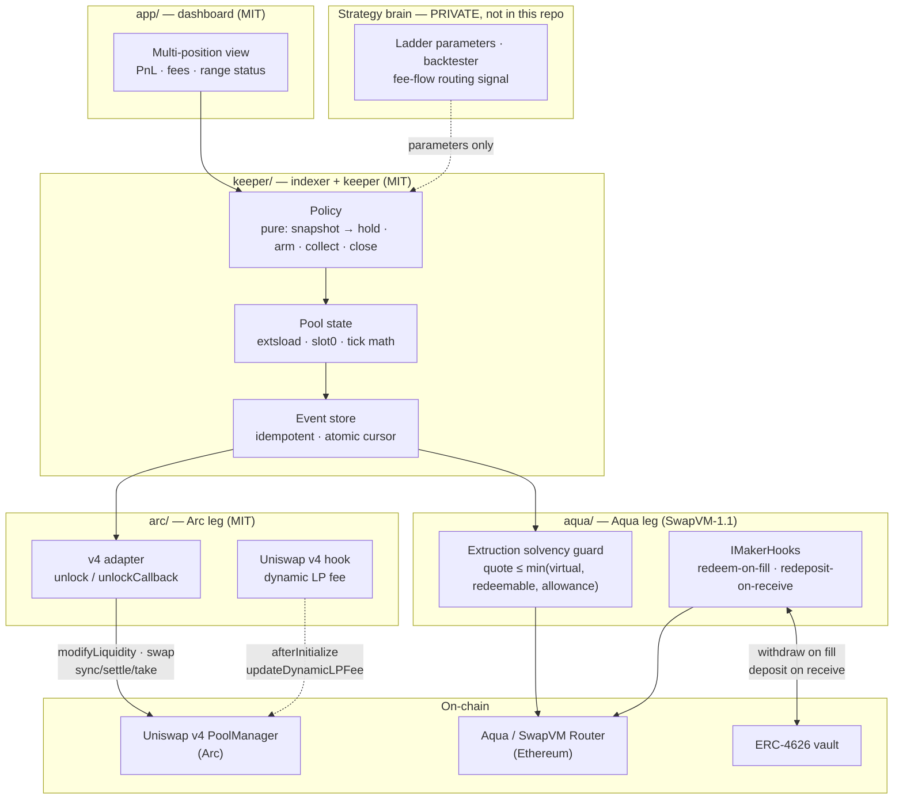

# Architecture

## The idea in one paragraph

A market maker's backing capital normally sits idle: it has to be *there* to honour a quote, so it does nothing else. Both legs of this project attack that from opposite ends. The **Aqua leg** keeps backing capital in an ERC-4626 vault earning yield and redeems from it *atomically on fill*, so the maker's return is `vault APY + spread` instead of just `spread`. The **Arc leg** observes that a concentrated liquidity range is itself a better execution primitive than a resting limit order — a one-sided range above spot is a take-profit ladder that also *collects fees while it waits*. Same conviction, two venues: **capital should be earning during the interval when it is only committed.**

## Shared engine, two venue adapters

The dotted line from the strategy brain is the important one. **What is open here is the execution layer — how a position is opened, held, and closed. What decides *which* position to open stays private.** That boundary is a deliberate product decision, not an artifact of the deadline: terminals for this have already been commoditised for free; the defensible part is the automation.

## Arc leg — one-sided concentrated liquidity on Uniswap v4

**Venue:** Circle's Arc — an L1 where USDC is both the gas token and the native asset, going to public mainnet Sep 16, 2026. Arc's hero asset is USDC and yield; a stablecoin-denominated market making engine is native to it in a way it would not be anywhere else.

The primitive:

- A one-sided range **above spot**, funded only in the base asset, is an **automatic take-profit ladder** — as price rises through it, the position converts to USDC, and it collects fees the whole way.
- A one-sided range **below spot**, funded only in USDC, is the mirror image: an **automatic bid ladder** that accumulates on dips.
- The **custom v4 hook** sets a dynamic LP fee, so the fee schedule can respond to volatility instead of being fixed at pool creation.

Measured on Arc testnet during the pre-hackathon probe: a `+5.25% … +11.76%` one-sided range realised an average sale price of `+8.46%` — the range's geometric mean, exactly as the math predicts. See [`../research/arc-probe/README.md`](../research/arc-probe/README.md).

### The Arc-specific constraint that shapes everything

Arc's USDC is a **native precompile** behind an ERC-20 shell, and Foundry's local fork does not implement it. Any USDC-touching call reverts inside `forge script` / `forge test` — and because `forge script` simulates before broadcasting, a USDC-touching script **silently never broadcasts while printing success**.

**Consequence for this architecture:** the deployment and position-management paths are built so that anything touching USDC executes as explicit calldata against a real node (`cast`), never through simulate-then-broadcast. Tests mock the precompile. This is why the scripts are split the way they are.

## Aqua leg — yield-backed market making on 1inch Aqua / SwapVM

The maker's inventory lives in an ERC-4626 vault. Two official extension points do the work — **no fork of SwapVM is required**, which is the single biggest finding from the pre-event feasibility work:

1. **`Extruction` — the solvency guard (quote-time).** Quoted size is capped at `min(virtual balance, assets actually redeemable from the vault, allowance)`. This exists because SwapVM's `ship()` does not itself verify that the maker can cover the quote; a maker whose capital is deployed elsewhere can quote what it cannot settle. The guard is the on-chain mitigation for that failure mode. It must behave identically in quote (view) and swap (stateful) contexts, which constrains it to be side-effect free.

2. **`IMakerHooks` — the settlement pipeline (fill-time).** `preTransferOut` redeems exactly the shortfall from the vault immediately before paying out; `postTransferIn` re-deposits incoming funds. Net effect: capital is in the vault except for the instant it is being paid out.

A liquidity buffer ratio keeps a working balance liquid so that common fills do not each pay for a vault round-trip.

## The keeper — what makes the Arc leg *automated* rather than merely *possible*

A one-sided range has a definite end: the moment it has fully converted. Until something watches for
that moment and acts on it, the primitive is a manual trade with extra steps. [`keeper/`](../keeper/)
is that watcher, and it closed a real Arc testnet position on its own on Sep 8, 2026.

Three properties are load-bearing, and they are the ones worth reviewing:

1. **The decision is a pure function.** Exit policy is a snapshot in, a verdict out — no clients, no
   clock, no I/O — so the rule a reviewer reads is the rule that runs, and it is tested without a
   node. A policy smeared across a polling loop is a policy nobody can check.
2. **The keeper hesitates.** The exit condition must survive three consecutive observations. A block
   that wicks past the range top and returns is not a converted ladder, and closing on it realises
   the wick instead of the trend.
3. **The keeper cannot steal.** `close` and `collect` take no recipient and always pay the position's
   owner, so a stolen keeper key buys an attacker nothing but early exits into the victim's own
   wallet. The Sep 8 run used a separate keeper key precisely so that claim is demonstrated rather
   than asserted.

The indexer beneath it exists because v4 keeps every pool inside one singleton: there is no per-pair
contract to query, so a pool's history *is* `Initialize` / `ModifyLiquidity` / `Swap` plus
`extsload`. The dashboard reads the folded result rather than walking chain state.

## Repository ↔ license map

| Directory | License | Rationale |
|---|---|---|
| `arc/`, `keeper/`, `app/`, `docs/` | MIT | Independent works; only form calldata and read state |
| `aqua/` | SwapVM-1.1 | Plugs into SwapVM's address space → a Modification under §1.7 |
| `research/` | MIT | Pre-hackathon probe, documented as such |

See [`../aqua/NOTICE.md`](../aqua/NOTICE.md).
